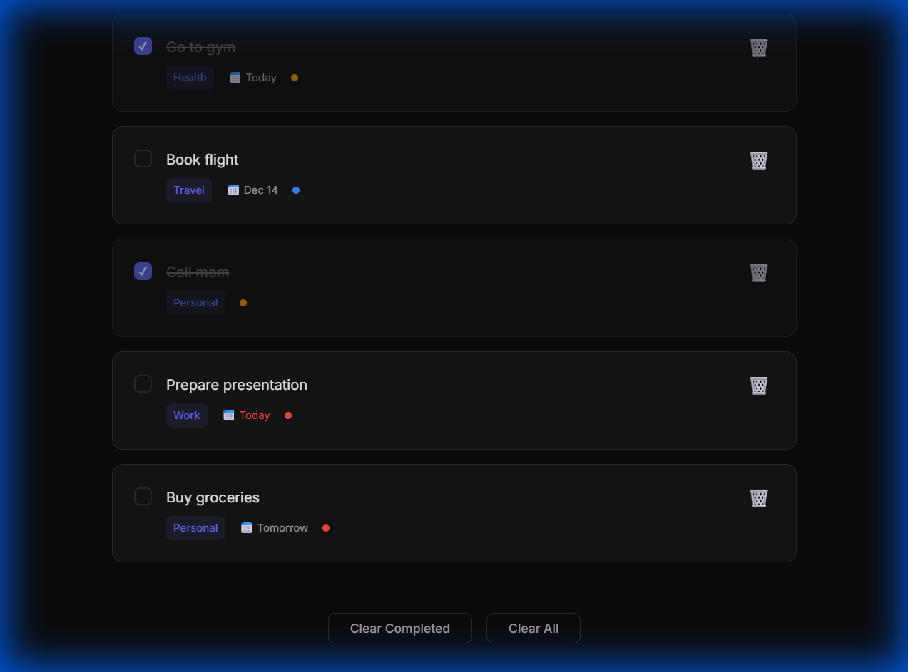

# Todo App - Minimalist Task Manager

A beautiful, minimalist dark mode todo application with advanced features for personal task management.

## Features

### ✨ Core Functionality

- **Add Tasks** - Create todos with a clean, intuitive interface
- **Voice Input** - Speak your tasks in Arabic, French, or English using the microphone button
- **Complete Tasks** - Mark tasks as done with a single click
- **Delete Tasks** - Remove tasks you no longer need
- **Local Storage** - All your tasks are saved automatically in your browser

### 🏷️ Organization

- **Categories** - Organize tasks with custom categories (Work, Personal, Health, etc.)
- **Priority Levels** - Set priority as Low, Medium, or High with visual indicators
- **Due Dates** - Add deadlines to your tasks with smart date formatting (Today, Tomorrow, etc.)
- **Overdue Detection** - Tasks past their due date are highlighted in red

### 🔍 Filtering & Search

- **Status Filters** - View All, Active, or Completed tasks
- **Category Filters** - Filter by specific categories with one click
- **Search** - Quickly find tasks by searching text or categories
- **Real-time Updates** - All filters update instantly as you type or click

### 🎨 Design

- **Dark Mode** - Easy on the eyes with a beautiful dark color scheme
- **Minimalist UI** - Clean, distraction-free interface
- **Smooth Animations** - Polished micro-interactions and transitions
- **Responsive** - Works perfectly on desktop, tablet, and mobile

## Usage

Simply open `index.html` in your browser to start using the app. No installation or setup required!

### Adding a Task

1. Type your task in the "What needs to be done?" field OR click the 🎤 microphone button to speak
2. (Optional) Select voice language (Arabic, French, or English) before using voice input
3. (Optional) Add a category, due date, and priority
4. Click "Add" or press Enter

### Managing Tasks

- Click the checkbox to mark a task as complete
- Click the 🗑️ icon to delete a task
- Use the filter buttons to view different task lists
- Type in the search box to find specific tasks
- Click category tags to filter by category

### Clearing Tasks

- **Clear Completed** - Remove all completed tasks
- **Clear All** - Delete all tasks (requires confirmation)

## Technical Details

- **Pure Vanilla JavaScript** - No frameworks or dependencies
- **Local Storage API** - Persistent data storage in the browser
- **CSS Custom Properties** - Easy theme customization
- **Semantic HTML** - Accessible and SEO-friendly markup
- **Modern CSS** - Grid, Flexbox, and smooth animations

## Files

- `index.html` - Main application structure
- `style.css` - Complete styling and design system
- `app.js` - All application logic and functionality

## Browser Compatibility

Works in all modern browsers that support:

- ES6 JavaScript
- CSS Custom Properties
- Local Storage API
- CSS Grid and Flexbox
- Web Speech API (for voice input - Chrome, Edge, Safari)

**Note:** Voice input requires microphone permissions and works best in Chrome, Edge, and Safari.

---

Built with ❤️ for personal productivity
